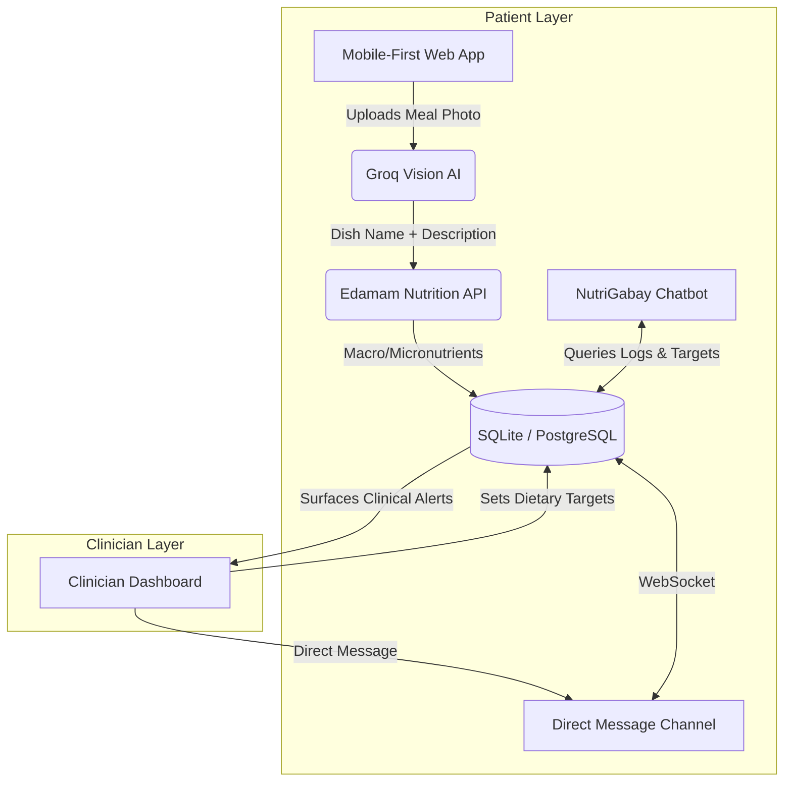

# Product Requirement Document (PRD)
## Project Name: NutriSync RPM
### Remote Patient Monitoring through Nutritional Intelligence

---

## 1. Executive Summary & Value Proposition

### 1.1 Elevator Pitch
> [!NOTE]
> **NutriSync RPM** is an AI-powered Remote Patient Monitoring platform that bridges the gap between hospital discharge and home recovery for Filipino patients with diet-related chronic diseases—connecting patients and clinicians through intelligent, photo-based nutritional tracking built specifically for the Philippine health context.

### 1.2 The Problem
In the Philippines, diet-related chronic illnesses (such as cardiovascular diseases, Stage II hypertension, Type 2 diabetes, and Chronic Kidney Disease) are leading causes of mortality. When patients are discharged from hospitals, they are given complex dietary prescriptions (e.g., "low sodium, low potassium, renal diet") which fail in practice due to:
* **Low Nutritional Literacy:** Patients cannot translate abstract metrics (e.g., "2g of sodium") into everyday meals (e.g., *tuyo*, *instant noodles*, *adobo*).
* **Western-Centric Databases:** Existing nutritional tools (MyFitnessPal, Lose It!) fail to recognize traditional Filipino dishes, *carinderia* (local eatery) items, and common street foods.
* **Post-Discharge Support Void:** Clinicians lack visibility into patient compliance between visits, leading to readmissions.

### 1.3 The Solution: A Two-Layer Ecosystem

---

## 2. User Personas

### 2.1 The Patient: Juan dela Cruz
* **Demographics:** 58 years old, lives in a suburban barangay in Cavite. Recently discharged after a mild stroke due to hypertension.
* **Technology Profile:** Uses a budget Android smartphone; relies heavily on Facebook Messenger; prefers Tagalog or Taglish.
* **Pain Points:**
  * Struggles to understand what he can and cannot eat.
  * Finds calorie-counting and gram-tracking apps extremely frustrating and tedious.
  * Cannot afford expensive clinical-grade dietitians.

### 2.2 The Clinician: Dr. Maria Santos
* **Demographics:** Cardiologist at a provincial public hospital. Manages 80+ outpatient cases.
* **Technology Profile:** Uses desktop computers at the clinic and an iPad on rounds.
* **Pain Points:**
  * Has no idea if patients are complying with low-sodium/low-fat instructions until they return in critical condition.
  * Needs a quick, clean summary of nutritional compliance.
  * Wants to send targeted reminders and communicate with patients directly between visits.

---

## 3. Implemented Features

### 3.1 Authentication & Onboarding (`/auth`)

* **User Registration** — Two-role registration flow (`patient` / `clinician`) with distinct form fields per role.
  * Patient: full name, email, password, explicit DPA 2012 consent checkbox (required).
  * Clinician: full name, email, password, profession, PRC license number, date of birth, optional PRC ID image upload (stored server-side).
* **JWT Login** — JSON-based login endpoint returns a signed JWT with role, user ID, and full name. A form-based `/auth/token` endpoint also exists for Swagger UI access.
* **Protected Routes** — React `ProtectedRoute` guards all patient and clinician screens; unauthenticated users are redirected to `/login`.
* **`GET /auth/me`** — Returns the currently authenticated user's profile.

---

### 3.2 Patient Experience (`/patient/*`)

#### Patient Dashboard (`/patient/dashboard`)
* **Daily Macro Gauges** — Circular SVG calorie ring and linear progress bars for sodium, carbs, protein, and fat — all computed against clinician-set targets fetched from `GET /api/patients/targets`.
* **Photo-Based Meal Logging** — Patient uploads a photo; the backend pipeline runs:
  1. **Groq Vision (llama-4-scout)** identifies the dish and generates a natural-language ingredient description.
  2. **Edamam Nutrition API** parses the description into macro/micronutrients (calories, carbs, protein, fat, sodium, potassium).
  3. A confirmation modal shows the AI result before the patient saves it via `POST /api/food/log`.
* **Scan Warning Modal** — A one-time disclaimer appears before the first photo scan, reminding the patient that AI estimates are approximate.
* **Meal Log Feed** — Paginated list of today's logged meals with expandable detail cards showing per-meal nutrient breakdown and the food photo (if available).
* **Sodium Inline Alert** — If today's sodium exceeds 60 % of the daily limit, an inline contextual warning highlights the highest-sodium meal and suggests corrective action.
* **Day-End Summary Banner** — After 23:00 local time a summary banner appears with the day's totals vs. targets.
* **NutriGabay AI Chatbot** — Slide-in chat panel powered by `POST /api/chat/`. Sends the patient's message alongside their active dietary targets and last 10 food logs as context. The Groq `llama-3.3-70b-versatile` model replies in friendly Tagalog/Taglish. Emergency symptom detection (chest pain, extreme dizziness) triggers an immediate instruction to seek emergency care.
* **Doctor Direct Message** — Patients with an assigned clinician can open a real-time WebSocket chat channel to their doctor (`useDoctorChat` hook → `wss://.../api/chat/direct/ws`). Unread badge count is fetched on load and updated live.
* **Clinical Reminders Panel** — Active reminders created by the clinician (medication, hydration, meal, activity, custom) are shown in a collapsible panel on the dashboard.
* **Patient Alerts** — `GET /api/patients/alerts` surfaces unresolved alerts. Clinician link invitations appear here; the patient can accept (which creates the `PatientClinicianLink` and initialises default `DietaryTargets`) or reject.

#### Patient Goals (`/patient/goals`)
* **Sodium Progress Card** — Live progress bar showing consumed vs. target sodium (sourced from the last 30 food logs).
* **Walking Distance Estimate** — A rough activity proxy derived from total logged calories (1 km ≈ 50 kcal burned) displayed as a progress bar against a 5 km goal.
* **Current Weight Card** — Manual weight entry via prompt; persists in local component state and renders a stylised bar chart.
* **Weekly Checklist** — Three toggleable checklist items: BP Consistency, Fiber Goals, and Fluid Intake. State is local (client-side only).
* **NutriGabay Goal Tip** — A static contextual tip card that changes copy based on whether the sodium target is met.

#### Patient Reports (`/patient/reports`)
* **Weekly Bar Chart** — Dual-bar chart (calories and sodium) for the last 7 days, computed from `GET /api/patients/logs?limit=30`.
* **Nutritional Insights Cards** — Sodium Management card and Potassium Intake card with dynamic copy based on the logged data.
* **Export to PDF** — Lazy-loads `jsPDF` + `jspdf-autotable`, fetches an AI-generated clinical summary from `GET /api/patients/reports/summary`, and generates a downloadable PDF with the summary, total stats, and a table of all logged meals.

#### Patient Profile (`/patient/profile`)
* Displays user's name, email, role, and ID from the `AuthContext`.
* Medical Settings panel with toggles for Clinical Alerts and Medication Reminders (local state only).
* Account Security panel (UI only — change PIN and Authorized Devices links are placeholder).
* Support & Help panel with FAQs, Chat with Care Team, and Privacy Policy links (UI placeholders).
* **Logout** button calls `logout()` from `AuthContext`, clears the JWT, and redirects to landing.

---

### 3.3 Clinician Dashboard (`/clinician/dashboard`)

The single-page clinician workspace is organised into tabbed sections:

#### Patient Management
* **Add Patient by Email** — `POST /api/clinicians/patients` sends a `CLINICIAN_LINK` alert to the patient; the link is established only after the patient accepts via their alert panel.
* **Patient List** — `GET /api/clinicians/patients` returns all accepted patients linked to the clinician. Each patient card is expandable.
* **Unlink Patient** — `DELETE /api/clinicians/patients/{patient_id}` removes the link and associated dietary targets.

#### Patient Detail Pane
* **Food Log Viewer** — `GET /api/clinicians/patients/{id}/logs` loads all logs for the selected patient, displayed as sortable meal cards with photo thumbnails.
* **Dietary Target Editor (`TargetEditor`)** — Inline form to `PUT /api/clinicians/patients/{id}/targets` for sodium, carbs, calories, potassium, protein, and fat limits.
* **AI Nutrition Summary** — `GET /api/clinicians/patients/{id}/summary` returns a 2–3 sentence clinical summary (Groq `llama-3.1-8b-instant`) covering the patient's last 30 meals.
* **Clinical Reminders (`ClinicalReminders`)** — Clinician can create, edit, toggle active/inactive, and delete reminders (medication, hydration, meal, activity, custom) for each patient via `POST / PUT / DELETE /api/clinicians/patients/{id}/reminders`.

#### Urgent Tasks (`UrgentTasks` component)
* Displays all unresolved `WARNING_SODIUM`, `CRITICAL_SODIUM`, and `WARNING_CALORIES` alerts from `GET /api/clinicians/alerts`.
* Filter bar (All / Critical / Warning) and patient-name search.
* Stats strip: total active alerts, critical count, warning count.
* **Resolve Action** — `PATCH /api/clinicians/alerts/{id}/resolve` marks the alert as resolved and removes it from the list.
* "Review Logs" shortcut navigates to the patient's detail pane.

#### Clinician Direct Messages (`ClinicianChatHub` component)
* Sidebar contact list of all linked patients with unread message badges.
* Real-time WebSocket chat (`wss://.../api/chat/direct/ws`) with per-patient conversation history loaded from `GET /api/chat/direct/history/{partner_id}`.
* Messages marked read on open via `PATCH /api/chat/direct/read/{partner_id}`.

---

## 4. Technical Architecture

### 4.1 System Components

| Layer | Technology |
| :--- | :--- |
| **Frontend** | React 18 + TypeScript, Vite, Tailwind CSS, Shadcn UI (Radix primitives) |
| **Backend** | Python 3.12, FastAPI, SQLModel (SQLAlchemy ORM), Pydantic v2 |
| **Database** | SQLite (dev) — schema-compatible with PostgreSQL for production |
| **Auth** | JWT (PyJWT) — HS256, `python-jose`, bcrypt password hashing |
| **Vision AI** | Groq API — `meta-llama/llama-4-scout-17b-16e-instruct` (image → food description) |
| **Nutrition Data** | Edamam Nutrition Analysis API (NLP ingredient parsing → macro/micronutrients) |
| **NutriGabay Chatbot** | Groq API — `llama-3.3-70b-versatile` (Tagalog/Taglish dietary Q&A) |
| **AI Summary** | Groq API — `llama-3.1-8b-instant` (clinical nutrition summary for clinicians) |
| **Real-Time Chat** | FastAPI `WebSocket`, in-memory `ChatConnectionManager`, `ChatMessage` DB table |
| **File Storage** | Local filesystem (`uploads/` directory), served as static files |

### 4.2 Database Schema

| Table | Purpose |
| :--- | :--- |
| `users` | Patients and clinicians; stores credentials, role, consent flag, PRC fields |
| `patient_clinician_links` | M:M join table for accepted patient–clinician relationships |
| `dietary_targets` | Per-patient daily limits (sodium, carbs, calories, potassium, protein, fat) |
| `food_logs` | Individual meal entries with AI-estimated nutrients and optional image URL |
| `clinical_alerts` | System-generated dietary exceedance alerts + clinician link invitations |
| `clinical_reminders` | Clinician-authored reminders (type, title, description, schedule) |
| `chat_messages` | Direct messages between patients and clinicians with read-status tracking |

### 4.3 Key API Routes

| Method | Path | Description |
| :--- | :--- | :--- |
| `POST` | `/api/auth/register` | Register patient or clinician |
| `POST` | `/api/auth/login` | JSON login → JWT |
| `GET` | `/api/auth/me` | Current user profile |
| `GET` | `/api/patients/targets` | Patient's dietary targets |
| `GET` | `/api/patients/logs` | Patient's food log history |
| `GET` | `/api/patients/alerts` | Patient's unresolved alerts (incl. link invites) |
| `PATCH` | `/api/patients/alerts/{id}/resolve` | Accept clinician link / dismiss alert |
| `PATCH` | `/api/patients/alerts/{id}/reject` | Reject clinician link invite |
| `GET` | `/api/patients/reminders` | Active reminders for patient |
| `GET` | `/api/patients/clinician` | Patient's assigned clinician profile |
| `GET` | `/api/patients/reports/summary` | AI-generated nutrition summary |
| `POST` | `/api/food/analyze-photo` | Upload image → Vision AI → Edamam → nutrients |
| `POST` | `/api/food/log` | Save confirmed meal entry + trigger alerts |
| `POST` | `/api/chat/` | NutriGabay chatbot (Tagalog/Taglish) |
| `WS` | `/api/chat/direct/ws` | Real-time direct message WebSocket |
| `GET` | `/api/chat/direct/history/{id}` | Conversation history with a user |
| `GET` | `/api/chat/direct/unread` | Unread message counts by sender |
| `PATCH` | `/api/chat/direct/read/{id}` | Mark messages as read |
| `GET` | `/api/clinicians/patients` | Clinician's linked patient list |
| `POST` | `/api/clinicians/patients` | Send link invite to patient by email |
| `DELETE` | `/api/clinicians/patients/{id}` | Unlink patient |
| `GET/PUT` | `/api/clinicians/patients/{id}/targets` | View / update patient's dietary targets |
| `GET` | `/api/clinicians/patients/{id}/logs` | Patient's food logs (clinician view) |
| `GET` | `/api/clinicians/patients/{id}/summary` | AI nutrition summary (clinician view) |
| `GET/POST` | `/api/clinicians/patients/{id}/reminders` | List / create reminders |
| `PUT/DELETE` | `/api/clinicians/patients/{id}/reminders/{rid}` | Update / deactivate reminder |
| `GET` | `/api/clinicians/alerts` | All unresolved dietary alerts across patients |
| `PATCH` | `/api/clinicians/alerts/{id}/resolve` | Resolve an alert |

### 4.4 Automatic Clinical Alert Logic
Triggered on every `POST /api/food/log` call after cumulating today's sodium and calories (resolved against the client's local timezone via the `X-Timezone-Offset` header):

| Alert Type | Trigger Condition |
| :--- | :--- |
| `WARNING_SODIUM` | Daily sodium > limit |
| `CRITICAL_SODIUM` | Daily sodium > 1.5× limit |
| `WARNING_CALORIES` | Daily calories > limit |

Duplicate alerts of the same type within the same calendar day are suppressed.

### 4.5 Data Privacy & Compliance (DPA 2012)
* **Consent management:** Explicit `consent_given` opt-in required for patient registration; enforced at both frontend and API levels.
* **Role-Based Access Control (RBAC):** Clinicians access only patients linked to them. Patients access only their own data. Enforced via `get_current_patient` / `get_current_clinician` dependency guards on every protected route.
* **JWT expiry:** Tokens are short-lived; credentials are never stored in plaintext.
* **HTTPS/TLS:** Required for production deployment (enforced by infrastructure, not application layer).

---

## 5. Key Workflows

### 5.1 Patient Logs a Meal (Happy Path)
1. Patient taps the **Scan Meal** button on the Patient Dashboard.
2. A one-time AI disclaimer modal is shown; patient acknowledges and selects a photo from their device.
3. The image is sent to `POST /api/food/analyze-photo`.
4. The Groq Vision model (llama-4-scout) identifies the dish and ingredients (e.g., *"1 bowl of pork sinigang, 1 cup of white rice"*).
5. The Edamam API parses the description into nutrient values.
6. A confirmation modal displays the identified dish name, description, and estimated nutrients.
7. Patient confirms → `POST /api/food/log` saves the entry and triggers alert evaluation.
8. The dashboard macro gauges update in real time.

### 5.2 NutriGabay Chatbot Consultation
1. Patient taps the floating chatbot button on the Patient Dashboard.
2. NutriGabay greets in Taglish: *"Magandang araw, Mang [Name]! Pwede mo akong tanungin..."*
3. Patient asks a dietary question (e.g., *"Pwede pa ba ako kumain ng saging?"*).
4. `POST /api/chat/` sends the message plus the patient's dietary targets and last 10 food logs as system context.
5. The Groq LLM returns a context-aware, friendly Taglish response.
6. If an emergency symptom is mentioned, the bot immediately instructs the patient to seek emergency care.

### 5.3 Clinician Links a Patient and Sets Targets
1. Clinician enters the patient's registered email in the **Add Patient** form.
2. `POST /api/clinicians/patients` creates a `CLINICIAN_LINK` alert for the patient.
3. Patient sees the invite in their alerts panel and taps **Accept**.
4. `PATCH /api/patients/alerts/{id}/resolve` creates the `PatientClinicianLink` record and initialises default `DietaryTargets`.
5. Patient now appears in the clinician's patient list.
6. Clinician opens the patient's detail pane and uses the **Target Editor** to set custom sodium, carbs, calorie, and potassium limits.
7. `PUT /api/clinicians/patients/{id}/targets` saves the changes; the patient's dashboard gauges reflect the new limits on next load.

### 5.4 Clinician Receives and Resolves a Dietary Alert
1. A patient exceeds their daily sodium limit; the system auto-generates a `WARNING_SODIUM` or `CRITICAL_SODIUM` alert on their next food log.
2. The **Urgent Tasks** tab on the Clinician Dashboard shows the alert with severity badge, metric category, and clinical detail message.
3. Clinician reviews the patient's logs via **Review Logs** shortcut.
4. Clinician taps **Resolve**; `PATCH /api/clinicians/alerts/{id}/resolve` archives the alert.

---

## 6. Current Limitations & Known Gaps

| Area | Current State |
| :--- | :--- |
| **Weight Tracking** | Weight is entered via a prompt and stored in local React state only — not persisted to the backend. |
| **Weekly Checklist** | BP Consistency, Fiber Goals, and Fluid Intake checklist items are local state only — not persisted. |
| **Profile Editing** | Profile page shows account details, caregiver contact, and residential address as static placeholder text; no edit API is wired up. |
| **Account Security** | Change PIN and Authorized Devices UI items are non-functional placeholders. |
| **Offline Support** | No `localStorage` caching or offline queue has been implemented. |
| **Gamification** | No compliance badges or streak tracking. |
| **EHR Integration** | No hooks for CHITS, iClinicSys, or other Philippine EHR systems. |
| **Speech-to-Text** | No voice logging feature. |
| **Inactivity Alerts** | No automatic alert for patients who have not logged for 48+ hours. |
| **PDF Charts** | The exported PDF contains a data table but no visual chart images. |
